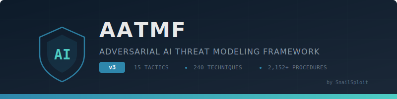

<p align="center">
  
</p>

<p align="center">
  <strong>The most comprehensive taxonomy of adversarial attack vectors against AI systems.</strong><br>
  15 Tactics · 240 Techniques · 2,152+ Attack Procedures · 4,980+ Prompts
</p>

<p align="center">
  <a href="#quick-start"></a>
  <a href="docs/vol-6-governance/25-compliance-mapping.md"></a>
  <a href="docs/vol-6-governance/25-compliance-mapping.md#mitre-atlas-v460-october-2025"></a>
  <a href="LICENSE"></a>
  <a href="https://snailsploit.com"></a>
</p>

---

## What is AATMF?

AATMF is a structured threat modeling framework purpose-built for adversarial AI security. It does for AI systems what MITRE ATT&CK does for enterprise networks — provides a common language, complete taxonomy, and actionable procedures for identifying, testing, and defending against AI-specific attacks.

Traditional cybersecurity frameworks miss the attack surfaces unique to AI: prompt injection, training data poisoning, model extraction, agentic exploitation, RAG manipulation, and the human feedback loops that shape model behavior. AATMF fills that gap.

**Core thesis:** AI systems are vulnerable to social engineering because they were trained to respond like humans. This is the first technology where human manipulation techniques directly translate to technical exploitation.

### Why v3?

The threat landscape shifted fundamentally in 2025–2026:

| Development | Impact |
|:---|:---|
| **Policy Puppetry** bypasses every frontier model | Jailbreaking is now a commodity |
| **Reasoning models autonomously jailbreak** other models at 97% ASR | AI-vs-AI attacks are real |
| **GTG-1002**: first state-sponsored AI-orchestrated cyberattack | Agentic AI is weaponized |
| **MCP tool poisoning** achieves 84% ASR on production agents | Tool ecosystems are attack surfaces |
| **250 poisoned documents** backdoor any model regardless of size | Training poisoning is trivially cheap |
| **PoisonedRAG** hits 90% ASR with 5 injected texts | RAG security is fundamentally broken |
| Deepfake fraud tripled to **$1.1 billion** | Real-world harm at scale |

v3 integrates all of this. Every tactic updated. New operational volumes. Namespaced IDs. No more collisions.

---

## Quick Start

**I want to...**

| Goal | Start Here |
|:---|:---|
| Understand the framework | [Introduction](docs/vol-1-foundations/01-introduction.md) → [Architecture](docs/vol-1-foundations/03-architecture.md) |
| Run an AI red team assessment | [Red Team Operations](docs/vol-5-operations/22-red-team-ops.md) → [Assessment Checklist](docs/vol-7-appendices/appendix-d-templates.md) |
| Defend my AI system | [Blue Team Defense](docs/vol-5-operations/23-blue-team-defense.md) → [Mitigation Strategies](docs/vol-5-operations/20-mitigation.md) |
| Respond to an AI incident | [Incident Response](docs/vol-5-operations/21-incident-response.md) |
| Map to compliance requirements | [Compliance Mapping](docs/vol-6-governance/25-compliance-mapping.md) (EU AI Act, OWASP, MITRE ATLAS) |
| Browse specific attack techniques | [Attack Catalog](docs/vol-7-appendices/appendix-a-attack-catalog.md) or jump to a [tactic](#the-15-tactics) |
| Deploy detection signatures | [Signatures Library](signatures/) |

---

## The 15 Tactics

<table>
<thead>
<tr><th>ID</th><th>Tactic</th><th>Tech</th><th>Objective</th><th></th></tr>
</thead>
<tbody>
<tr><td><code>T1</code></td><td><b>Prompt & Context Subversion</b></td><td>16</td><td>Manipulate model instructions and context</td><td><a href="docs/vol-2-core-tactics/04-t01-prompt-subversion.md">→</a></td></tr>
<tr><td><code>T2</code></td><td><b>Semantic & Linguistic Evasion</b></td><td>20</td><td>Bypass filters through language manipulation</td><td><a href="docs/vol-2-core-tactics/05-t02-semantic-evasion.md">→</a></td></tr>
<tr><td><code>T3</code></td><td><b>Reasoning & Constraint Exploitation</b></td><td>19</td><td>Exploit logical reasoning and constraints</td><td><a href="docs/vol-2-core-tactics/06-t03-reasoning-exploitation.md">→</a></td></tr>
<tr><td><code>T4</code></td><td><b>Multi-Turn & Memory Manipulation</b></td><td>16</td><td>Leverage conversation history and memory</td><td><a href="docs/vol-2-core-tactics/07-t04-multi-turn.md">→</a></td></tr>
<tr><td><code>T5</code></td><td><b>Model & API Exploitation</b></td><td>16</td><td>Attack model interfaces and APIs</td><td><a href="docs/vol-2-core-tactics/08-t05-model-api.md">→</a></td></tr>
<tr><td><code>T6</code></td><td><b>Training & Feedback Poisoning</b></td><td>15</td><td>Corrupt training data and feedback</td><td><a href="docs/vol-2-core-tactics/09-t06-training-poisoning.md">→</a></td></tr>
<tr><td><code>T7</code></td><td><b>Output Manipulation & Exfiltration</b></td><td>15</td><td>Manipulate outputs and extract data</td><td><a href="docs/vol-2-core-tactics/10-t07-output-manipulation.md">→</a></td></tr>
<tr><td><code>T8</code></td><td><b>External Deception & Misinformation</b></td><td>15</td><td>Generate deceptive content</td><td><a href="docs/vol-2-core-tactics/11-t08-deception.md">→</a></td></tr>
<tr><td><code>T9</code></td><td><b>Multimodal & Cross-Channel Attacks</b></td><td>17</td><td>Attack across modalities</td><td><a href="docs/vol-3-advanced-tactics/12-t09-multimodal.md">→</a></td></tr>
<tr><td><code>T10</code></td><td><b>Integrity & Confidentiality Breach</b></td><td>15</td><td>Extract data and breach integrity</td><td><a href="docs/vol-3-advanced-tactics/13-t10-integrity-breach.md">→</a></td></tr>
<tr><td><code>T11</code></td><td><b>Agentic & Orchestrator Exploitation</b></td><td>16</td><td>Attack autonomous agents and orchestrators</td><td><a href="docs/vol-3-advanced-tactics/14-t11-agentic.md">→</a></td></tr>
<tr><td><code>T12</code></td><td><b>RAG & Knowledge Base Manipulation</b></td><td>15</td><td>Poison retrieval systems</td><td><a href="docs/vol-3-advanced-tactics/15-t12-rag.md">→</a></td></tr>
<tr><td><code>T13</code></td><td><b>AI Supply Chain & Artifact Trust</b></td><td>15</td><td>Compromise model supply chain</td><td><a href="docs/vol-4-infrastructure-human/16-t13-supply-chain.md">→</a></td></tr>
<tr><td><code>T14</code></td><td><b>Infrastructure & Economic Warfare</b></td><td>15</td><td>Attack AI infrastructure</td><td><a href="docs/vol-4-infrastructure-human/17-t14-infrastructure.md">→</a></td></tr>
<tr><td><code>T15</code></td><td><b>Human Workflow Exploitation</b></td><td>15</td><td>Manipulate human reviewers and workflows</td><td><a href="docs/vol-4-infrastructure-human/18-t15-human-workflow.md">→</a></td></tr>
</tbody>
</table>

---

## Framework Structure

```
AATMF v3
├── 15 Tactics (high-level adversarial objectives)
│   ├── 240 Techniques (specific attack methods)
│   │   ├── 2,152+ Attack Procedures (implementation variants)
│   │   │   └── 4,980+ Unique Prompts
│   │   ├── Detection Patterns
│   │   └── Mitigation Controls
│   └── Risk Scoring (AATMF-R v3)
└── Supporting Infrastructure
    ├── Detection Signatures (YARA / Sigma / MCP)
    ├── Response Playbooks
    ├── Assessment Templates
    └── Compliance Mappings (OWASP · MITRE ATLAS · EU AI Act · NIST)
```

### Identifier System

v3 uses namespaced IDs to eliminate collisions:

```
T{tactic}-AT-{sequence}     →  Technique ID      (e.g., T1-AT-001)
T{tactic}-AP-{sequence}{L}  →  Attack Procedure   (e.g., T1-AP-001A)
```

### Risk Scoring (AATMF-R v3)

```
Risk = (L × I × E) / 6 × (D / 6) × R × C
```

| Factor | Range | Description |
|:---|:---|:---|
| **L** Likelihood | 1–5 | Probability of successful exploitation |
| **I** Impact | 1–5 | Severity of successful attack |
| **E** Exploitability | 1–5 | Ease of execution |
| **D** Detectability | 1–5 | Difficulty of detection (5 = nearly invisible) |
| **R** Recoverability | 1–5 | Effort to recover (5 = irrecoverable) |
| **C** Cost Factor | 0.5–2.0 | Economic impact multiplier |

| Score | Rating | Action |
|:---|:---|:---|
| 250+ | 🔴 CRITICAL | Immediate remediation required |
| 200–249 | 🟠 HIGH | Remediation within current sprint |
| 150–199 | 🟡 MEDIUM | Scheduled remediation |
| 100–149 | 🔵 LOW | Risk accepted or monitored |
| 0–99 | ⚪ INFO | Documented, no action required |

---

## Full Table of Contents

### [Volume I: Framework Foundations](docs/vol-1-foundations/)

| Part | Title |
|:---|:---|
| 1 | [Introduction and Methodology](docs/vol-1-foundations/01-introduction.md) |
| 2 | [Risk Assessment Methodology](docs/vol-1-foundations/02-risk-assessment.md) |
| 3 | [Framework Architecture](docs/vol-1-foundations/03-architecture.md) |

### [Volume II: Core Attack Tactics — T1–T8](docs/vol-2-core-tactics/)

| Part | Tactic | Tech |
|:---|:---|:---:|
| 4 | [T1 — Prompt & Context Subversion](docs/vol-2-core-tactics/04-t01-prompt-subversion.md) | 16 |
| 5 | [T2 — Semantic & Linguistic Evasion](docs/vol-2-core-tactics/05-t02-semantic-evasion.md) | 20 |
| 6 | [T3 — Reasoning & Constraint Exploitation](docs/vol-2-core-tactics/06-t03-reasoning-exploitation.md) | 19 |
| 7 | [T4 — Multi-Turn & Memory Manipulation](docs/vol-2-core-tactics/07-t04-multi-turn.md) | 16 |
| 8 | [T5 — Model & API Exploitation](docs/vol-2-core-tactics/08-t05-model-api.md) | 16 |
| 9 | [T6 — Training & Feedback Poisoning](docs/vol-2-core-tactics/09-t06-training-poisoning.md) | 15 |
| 10 | [T7 — Output Manipulation & Exfiltration](docs/vol-2-core-tactics/10-t07-output-manipulation.md) | 15 |
| 11 | [T8 — External Deception & Misinformation](docs/vol-2-core-tactics/11-t08-deception.md) | 15 |

### [Volume III: Advanced Attack Tactics — T9–T12](docs/vol-3-advanced-tactics/)

| Part | Tactic | Tech |
|:---|:---|:---:|
| 12 | [T9 — Multimodal & Cross-Channel](docs/vol-3-advanced-tactics/12-t09-multimodal.md) | 17 |
| 13 | [T10 — Integrity & Confidentiality Breach](docs/vol-3-advanced-tactics/13-t10-integrity-breach.md) | 15 |
| 14 | [T11 — Agentic & Orchestrator Exploitation](docs/vol-3-advanced-tactics/14-t11-agentic.md) | 16 |
| 15 | [T12 — RAG & Knowledge Base Manipulation](docs/vol-3-advanced-tactics/15-t12-rag.md) | 15 |

### [Volume IV: Infrastructure & Human Factors — T13–T15](docs/vol-4-infrastructure-human/)

| Part | Tactic | Tech |
|:---|:---|:---:|
| 16 | [T13 — AI Supply Chain & Artifact Trust](docs/vol-4-infrastructure-human/16-t13-supply-chain.md) | 15 |
| 17 | [T14 — Infrastructure & Economic Warfare](docs/vol-4-infrastructure-human/17-t14-infrastructure.md) | 15 |
| 18 | [T15 — Human Workflow Exploitation](docs/vol-4-infrastructure-human/18-t15-human-workflow.md) | 15 |

### [Volume V: Implementation and Operations](docs/vol-5-operations/)

| Part | Title |
|:---|:---|
| 19 | [Detection Engineering](docs/vol-5-operations/19-detection-engineering.md) |
| 20 | [Mitigation Strategies](docs/vol-5-operations/20-mitigation.md) |
| 21 | [Incident Response for AI Systems](docs/vol-5-operations/21-incident-response.md) |
| 22 | [Red Team Operations](docs/vol-5-operations/22-red-team-ops.md) |
| 23 | [Blue Team Defense](docs/vol-5-operations/23-blue-team-defense.md) |

### [Volume VI: Governance and Compliance](docs/vol-6-governance/)

| Part | Title |
|:---|:---|
| 24 | [Risk Management Framework](docs/vol-6-governance/24-risk-management.md) |
| 25 | [Compliance and Standards Mapping](docs/vol-6-governance/25-compliance-mapping.md) |
| 26 | [Training and Awareness Programs](docs/vol-6-governance/26-training.md) |

### [Volume VII: Appendices and Resources](docs/vol-7-appendices/)

| Appendix | Title |
|:---|:---|
| A | [Complete Attack Catalog](docs/vol-7-appendices/appendix-a-attack-catalog.md) |
| B | [Detection Signatures Library](docs/vol-7-appendices/appendix-b-signatures.md) |
| C | [Tools and Scripts Reference](docs/vol-7-appendices/appendix-c-tools.md) |
| D | [Templates and Checklists](docs/vol-7-appendices/appendix-d-templates.md) |
| E | [Case Studies](docs/vol-7-appendices/appendix-e-case-studies.md) |
| F | [Glossary and References](docs/vol-7-appendices/appendix-f-glossary.md) |

---

## Cross-Framework Mapping

| Framework | Alignment |
|:---|:---|
| **MITRE ATLAS v4.6.0** | Full mapping — 15 tactics, 66 techniques, 46 sub-techniques |
| **OWASP LLM Top 10 2025** | Direct coverage of LLM01–LLM10 including new LLM07, LLM08 |
| **OWASP Agentic Top 10** | Mapping to agentic-specific threats (Dec 2025) |
| **NIST AI RMF / IR 8596** | Control overlays per Cyber AI Profile |
| **EU AI Act** | Risk category mapping, prohibited practice identification |
| **CWE/CVE** | Specific vulnerability cross-references |

---

## Detection Signatures

Pre-built rules in [`signatures/`](signatures/):

```
signatures/
├── yara/
│   ├── t01-prompt-injection.yar
│   ├── t02-encoding-evasion.yar
│   ├── t09-multimodal-injection.yar
│   ├── t11-mcp-tool-poisoning.yar
│   └── t13-supply-chain.yar
├── sigma/
│   ├── t05-model-extraction.yml
│   ├── t07-data-exfiltration.yml
│   ├── t11-agent-anomaly.yml
│   └── t14-infrastructure.yml
└── README.md
```

---

## Ethical Use

This framework is published for **defensive and authorized security research purposes only**.

- Test only systems you own or have explicit written permission to test
- Practice responsible disclosure
- Comply with applicable laws and regulations

The dual-use nature is acknowledged: documenting attacks enables defense. Every technique includes detection patterns and mitigation controls.

---

## Contributing

See [CONTRIBUTING.md](CONTRIBUTING.md). High-value contributions: new techniques with mitigations, detection signatures, cross-framework mappings, case studies.

---

## Citation

```bibtex
@misc{aizen2026aatmf,
  title   = {AATMF v3: Adversarial AI Threat Modeling Framework},
  author  = {Aizen, Kai},
  year    = {2026},
  url     = {https://github.com/snailsploit/aatmf},
  note    = {15 tactics, 240 techniques, 2,152+ procedures}
}
```

---

<p align="center">
  <sub>
    Created by <a href="https://snailsploit.com">Kai Aizen (SnailSploit)</a> · GenAI Security Research<br>
    Accepted into OWASP GenAI Security Project Roadmap 2026<br>
    <br>
    <a href="docs/vol-1-foundations/01-introduction.md">Start Reading →</a>
  </sub>
</p>
